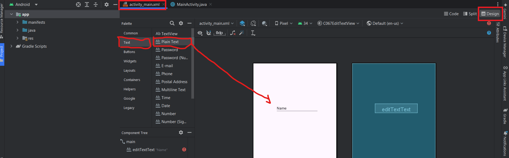
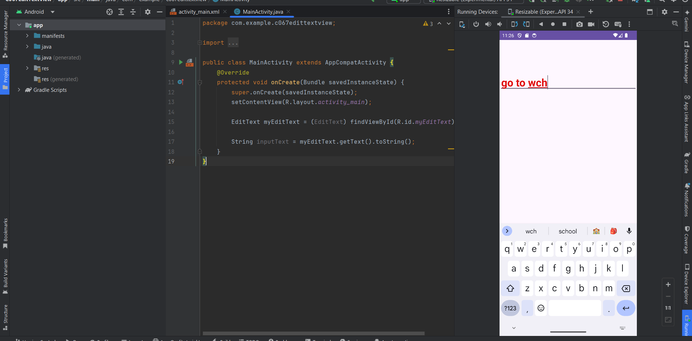

# __EDITTEXT__

- EditText là View cho phép user nhập dữ liệu từ bàn phím vào chương trình

## __DESIGN EDITTEXT__
- có 2 cách tạo 1 EditText
    - drag drop
    - code xml
- để drag drop EditText vào layout, trong file xml thiết kế
    - chọn tab design
    - trong Pallet quản lý View chọn Text
    - danh sách các View thuộc về Text chọn Plain Text
    - kéo Plain Text thả vào màn hình layout



- sử dụng code xml, trong file xml, khai báo tag \<EditText /> bên trong View Group Layout

```xml
<?xml version="1.0" encoding="utf-8"?>
<androidx.constraintlayout.widget.ConstraintLayout xmlns:android="http://schemas.android.com/apk/res/android"
    xmlns:app="http://schemas.android.com/apk/res-auto"
    xmlns:tools="http://schemas.android.com/tools"
    android:id="@+id/main"
    android:layout_width="match_parent"
    android:layout_height="match_parent"
    tools:context=".MainActivity">

    <EditText
        android:id="@+id/myEditText"
        android:layout_width="match_parent"
        android:layout_height="wrap_content"
        android:layout_marginTop="100dp"
        android:hint="Input your text"
        android:maxLength="120"
        android:padding="5dp"
        android:textColor="#E00C0C"
        android:textSize="32sp"
        android:textStyle="bold"
        app:layout_constraintEnd_toEndOf="parent"
        app:layout_constraintStart_toStartOf="parent"
        app:layout_constraintTop_toTopOf="parent" />

</androidx.constraintlayout.widget.ConstraintLayout>
```

- EditText cũng tương tự như TextView, nhưng có 1 vài attribute đặc biệt
    - ``hint``: text được làm mờ hiển thị trên EditText, gợi ý nội dung cho user nhập dữ liệu vào, khi user click vào hint sẽ biến mất

## __TƯƠNG TÁC LẬP TRÌNH VỚI EDITTEXT__

- với tất cả các View, để tương tác được với chúng trong code chương trình cần:
    - khai báo ĐÚNG đối tượng View
    - khởi tạo tham chiếu chính xác đến ``id`` đã được khai báo trong layout đến View thông qua method ``findViewById(int)``

```java
public class MainActivity extends AppCompatActivity {
    @Override
    protected void onCreate(Bundle savedInstanceState) {
        super.onCreate(savedInstanceState);
        setContentView(R.layout.activity_main);
        
        EditText myEditText = (EditText) findViewById(R.id.myEditText);

        String inputText = myEditText.getText().toString();
    }
}
```
- từ đối tượng EditText ta có thể ``getText()`` và chuyển sang ``toString()`` để lưu trữ giá trị của View EditText vào variable String
- chạy chương trình và thực hiện input dữ liệu từ keyboard vào EditText

